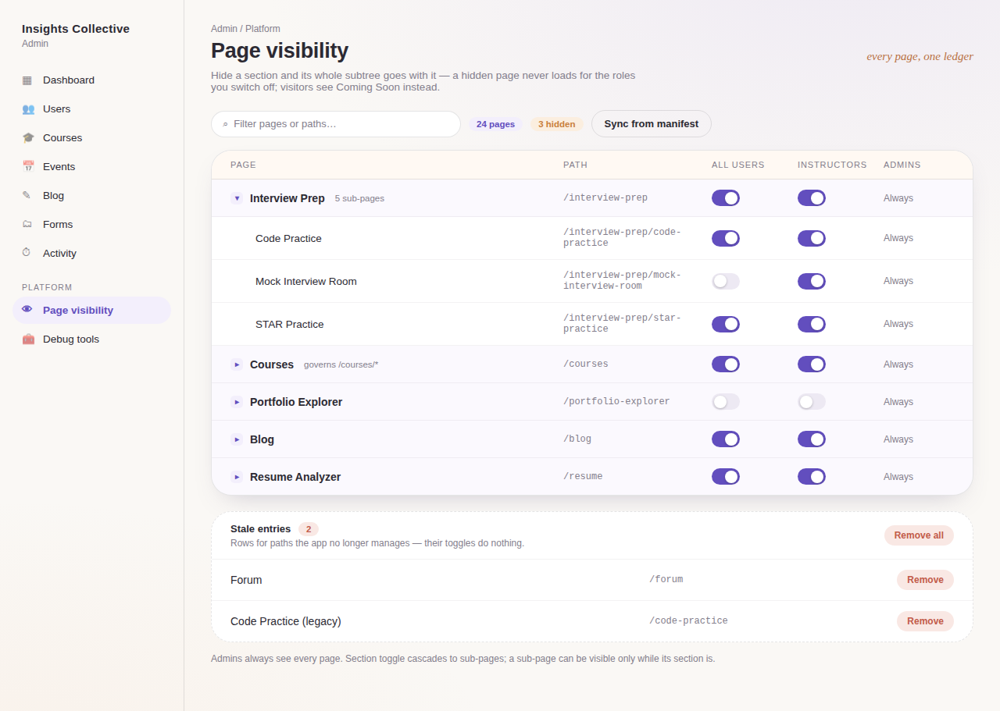
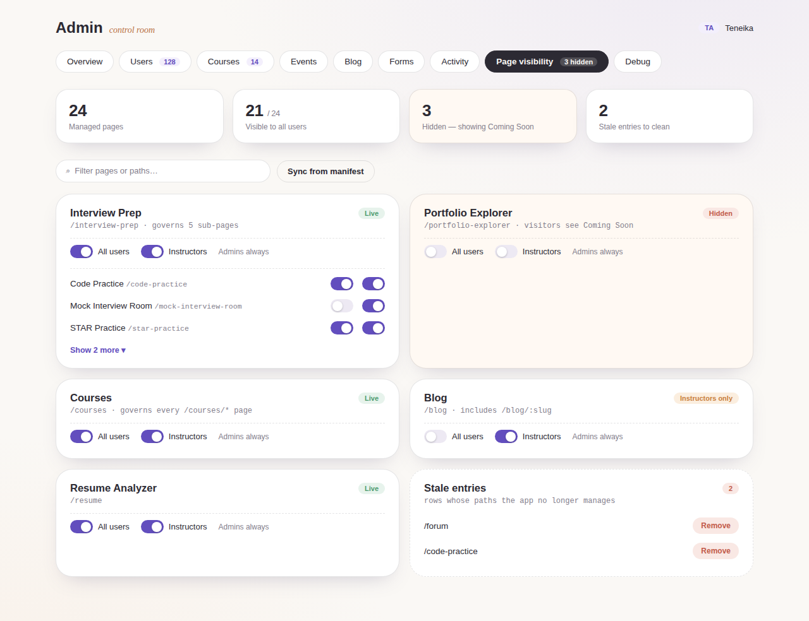
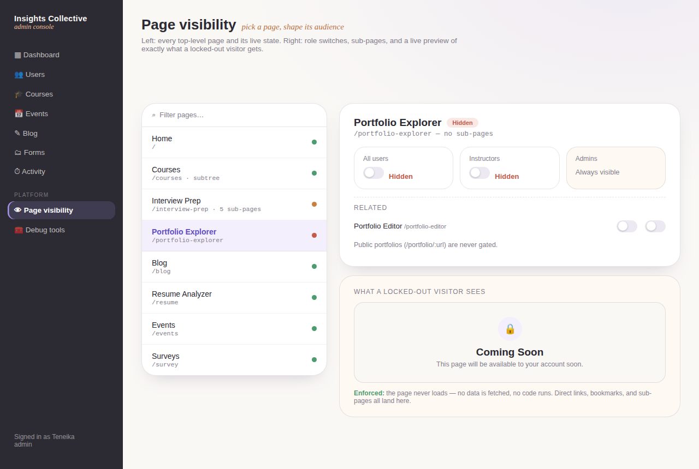

# Admin Shell + Page Visibility — Soft Studio Concept Boards

Three alternatives for the unified admin experience: a shared admin shell
(section navigation for Dashboard, Users, Courses, Events, Blog, Forms,
Activity, Page Visibility, Debug) with the redesigned Page Visibility manager
as the featured section. All three use the established Soft Studio system
(plaster `#FAF8F5`, lavender `#A794EB`/`#624EBE`, peach `#F0BE96`/`#B97143`,
soft semantic good/warn/bad/teal, Outfit + Lora Italic, 26px cards, pill
controls) — the same tokens that now drive the whole site.

Common to every concept:

- **One admin surface.** The 12 scattered `/admin/*` routes become sections
  of a single shell with one admin guard at the layout; Page Visibility and
  the Storage Debugger live inside it.
- **Manifest-driven manager.** Top-level pages come from
  `src/config/pageManifest.ts`, grouped with their sub-pages; hiding a
  section hides its whole subtree (shown as "governs /courses/*").
- **Role columns** (All users / Instructors / Admins-always) matching the
  `page_visibility` table, plus a stale-entries cleanup affordance.

## Concept 1 — Ledger

Light section rail on plaster; the manager is one dense, scannable table —
collapsible section rows with indented children, warm header band, switches
in-row. Closest to the current admin mental model (tables), best for
scale (all 24 pages visible at once), cheapest to build.

## Concept 2 — Control Room

No rail — horizontal pill section switcher with live counts, a KPI strip
(managed / visible / hidden / stale), and one card per top-level page with
role switches and expandable children inline. Most glanceable state
overview; the "Hidden" card going warm is the standout affordance.

## Concept 3 — Studio Console

Ink-rail console (the dark-panel look the course builder carries into Soft
Studio) with a master-detail manager: page list with live/partial/hidden
dots on the left, and on the right the selected page's role tiles, its
sub-pages, and a **live preview of the Coming Soon page** a locked-out
visitor gets — making the enforcement visible while you toggle. Most
distinctive; slightly more build (selection state + preview pane).

## Notes for implementation (any concept)

- The shell becomes `src/pages/admin/AdminLayout.tsx` + nested `/admin/*`
  routes with `ProtectedRoute requireAdmin` applied once at the layout.
- Section toggles cascade: switching a section off writes all child rows;
  a child switch is disabled (with explanation) while its parent is hidden.
- "Sync from manifest" replaces the old Sync Pages + Check DB buttons; it
  upserts manifest entries and removes stale rows in one action.
- Admin bypass stays: admins always see every page, so toggles never lock
  the person using them out.
