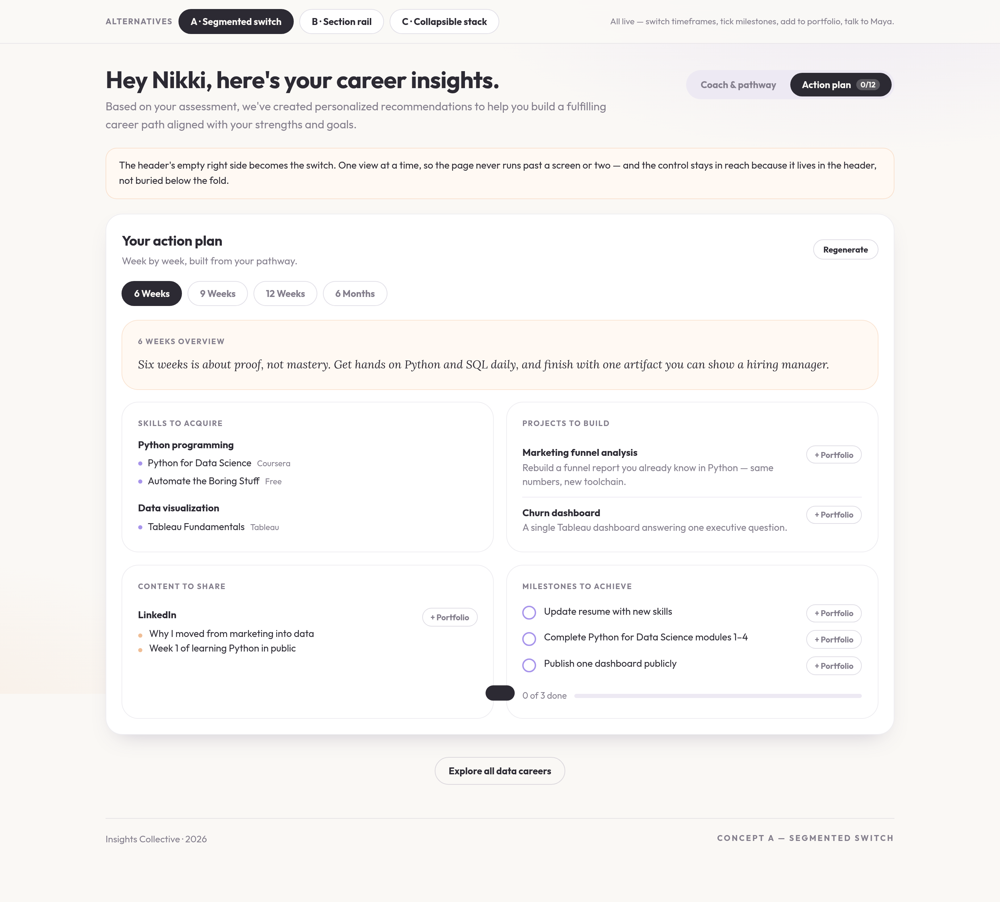

# Career Pathway — long-page layout alternatives

The page currently stacks three things vertically: the coach conversation and
the generated pathway side by side, then the action plan below. Reaching the
action plan means scrolling past the whole report, and the header's right side
sits empty. These three concepts each tame that differently, using the page's
real sections (Summary, Top match, Skills & courses, Path to <role>, Roles that
fit you today, Key takeaways, and the action plan's timeframe pills with Skills
to acquire, Projects to build, Content to share, Milestones to achieve).

## Try them

`concepts-career-pathway.html` in this directory is the source for the
interactive prototype. The concepts work rather than pose — the timeframe pills
swap the plan, milestone checkboxes update every counter on the page, portfolio
buttons toggle, and the coach answers. All three share one state object, so a
milestone ticked in Concept A is still ticked when you switch to B.

The fonts are inlined as base64 `@font-face` sources at build time; the file in
this directory keeps the `__OUTFIT_REG__` / `__OUTFIT_BOLD__` / `__LORA_IT__`
placeholders so it stays readable in review.

## Concept A — Segmented switch

A two-way switch ("Coach & pathway" / "Action plan") lives in the empty header
space, carrying a live milestone count. One view at a time, so neither half is
buried under the other, and the action plan is one tap from the top of the page
rather than a scroll past the whole report.

The switch sits in the header and scrolls with it, exactly as in the prototype —
it is not pinned. Switching returns you to the top of the new view.

The action plan panel:

## Concept B — Section rail

Everything stays on one page, with a sticky left rail that tracks the current
section via scroll-spy and jumps anywhere instantly. Nothing is hidden and
scroll position is always legible — closest to the current page, just navigable.
Milestones get their own anchor so the plan's most actionable part is one click
from anywhere.

## Concept C — Collapsible stack

Each area is an open/close section with a status chip (Pathway ready, 4 roles,
"1 of 12 milestones · 6 Weeks"). Coach and pathway start open; roles and the
action plan start collapsed, with an Expand all / Collapse all control in the
header. Short by default, everything one click away, and the chips summarize
each section without expanding it.

## Recommendation

**A.** It solves both problems at once — the action plan stops being something
you scroll past, and the empty header space becomes the control that gets you
there. B keeps the page long, and C's collapsed sections hide the plan behind a
click without shortening the path to it the way A's switch does.
