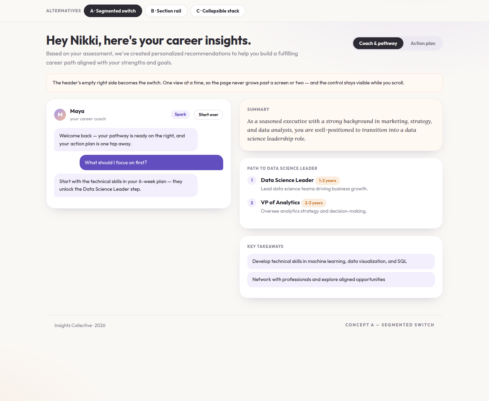
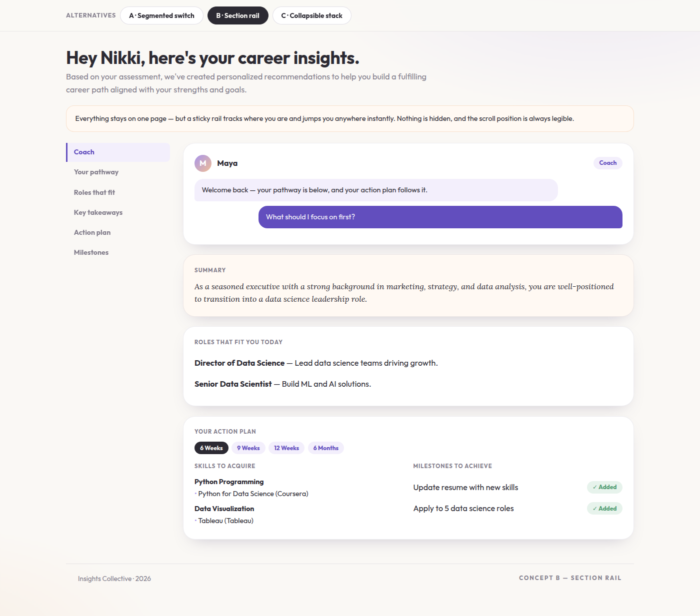
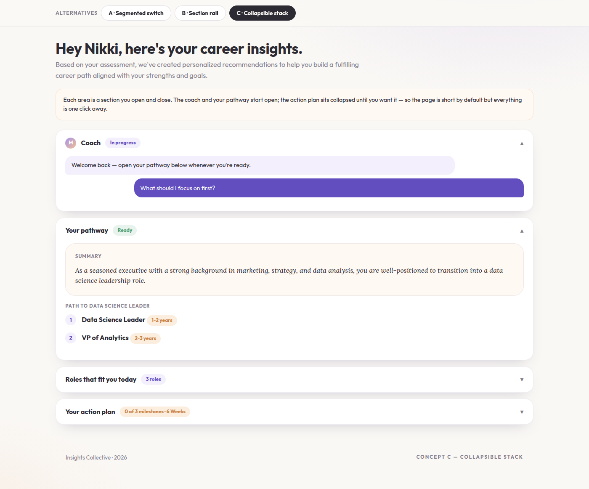

# Career Pathway — long-page layout alternatives

The page currently stacks three things vertically: the coach conversation and
the generated pathway side by side, then the action plan below. Reaching the
action plan means scrolling past the whole report, and the header's right side
sits empty. These three concepts each tame that differently, using the page's
real sections (Summary, Path to <role>, Roles that fit you today, Key
takeaways, Your action plan with its timeframe pills, Skills to acquire,
Projects to build, Content to share, Milestones to achieve).

## Concept A — Segmented switch

A two-way switch ("Coach & pathway" / "Action plan") lives in the empty header
space. One view at a time, so the page never exceeds a screen or two and the
control stays visible while scrolling. Shortest page; the action plan is one
tap rather than a scroll.

## Concept B — Section rail

Everything stays on one page, with a sticky left rail that tracks the current
section and jumps anywhere instantly. Nothing is hidden and scroll position is
always legible — closest to the current page, just navigable.

## Concept C — Collapsible stack

Each area is an open/close section with a status chip (In progress, Ready,
3 roles, 0 of 3 milestones). Coach and pathway start open; the action plan
starts collapsed. Short by default, everything one click away, and the chips
summarize each section without expanding it.
