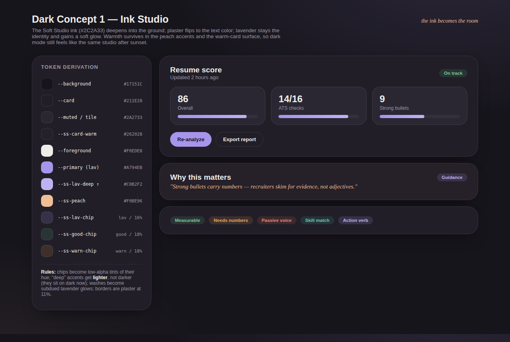
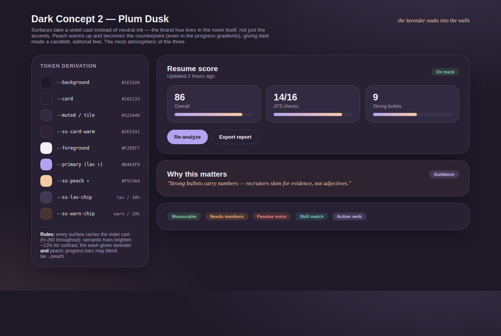
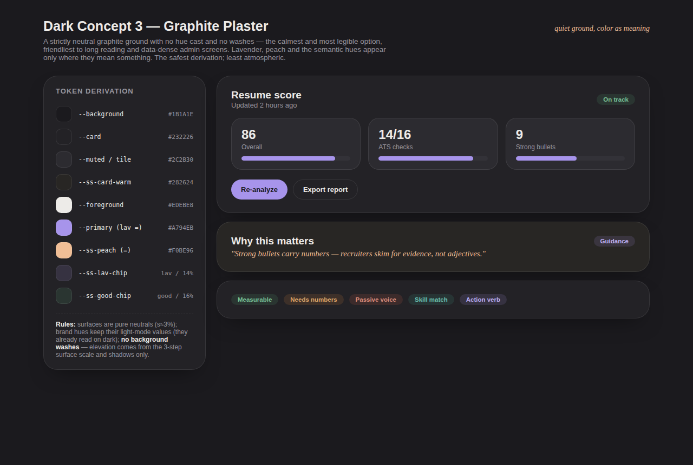

# Soft Studio Dark Mode — Concept Boards

Three derivations of the Soft Studio token set for a real, working dark mode
(theme toggle + `prefers-color-scheme`, replacing the dead legacy `.dark`
block and its 178 stale `dark:` utilities). Each board shows the same page
mockup — score card with stat tiles, warm guidance card, semantic chip row —
plus the full token derivation and the rules that generate it, so whichever
concept wins can be applied mechanically to every `--ss-*` token.

Shared mechanics (all concepts):

- **Token-level theming.** One `.dark { … }` block overrides the `:root`
  Soft Studio set (shadcn tokens + all `--ss-*` + `--sidebar-*` + the wash).
  Converted pages need no per-component work.
- **Chips become tints.** Solid pastel chip fills (`#E7F3EC` …) become
  low-alpha tints of their hue (~14–20%), keeping the chip language while
  sitting naturally on dark surfaces.
- **Borders stay alpha-in-token** (foreground at ~10–12%), which is exactly
  how light mode already works — it inverts for free.
- **Toggle**: sun/moon/system in the navbar + profile menu, persisted, with
  `next-themes` (already a dependency).

## Concept 1 — Ink Studio

The Soft Studio ink (`#2C2A33`) deepens into the ground (`#17151C`); plaster
flips to the text color; lavender keeps the identity and gains a soft glow
wash. "Deep" accents lighten instead of darken. The truest inversion of the
existing system — recognizably the same studio after dark.

## Concept 2 — Plum Dusk

Violet-tinted surfaces — the brand hue lives in the walls, not just the
accents — with peach warmed up as the counterpoint (it even joins the
progress gradients). Candlelit and atmospheric; the most distinctive, and
the most opinionated.

## Concept 3 — Graphite Plaster

Strictly neutral graphite, no hue cast, **no washes** — elevation comes from
a 3-step surface scale and shadows. Brand hues keep their light-mode values
and appear only where they carry meaning. Calmest and most legible,
friendliest to data-dense admin screens; least atmospheric.

## Implementation notes (any concept)

- `ThemeProvider` (`next-themes`, `attribute="class"`, `defaultTheme="system"`)
  wraps the app; Tailwind is already `darkMode: ["class"]`.
- The 178 legacy `dark:` utilities across 31 files target the deleted old
  palette and are removed in the same change that lands the new `.dark`
  block — token-level theming replaces them.
- Charts and Monaco need explicit theme wiring (`ui/chart.tsx`, the code
  editor surface).
- Visual e2e baselines run in both themes after this lands.
