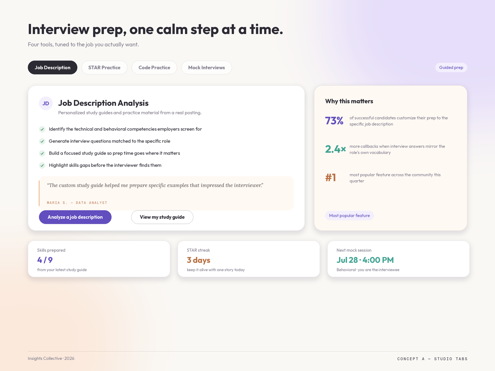
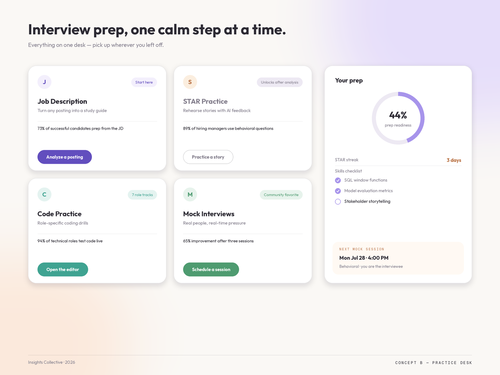
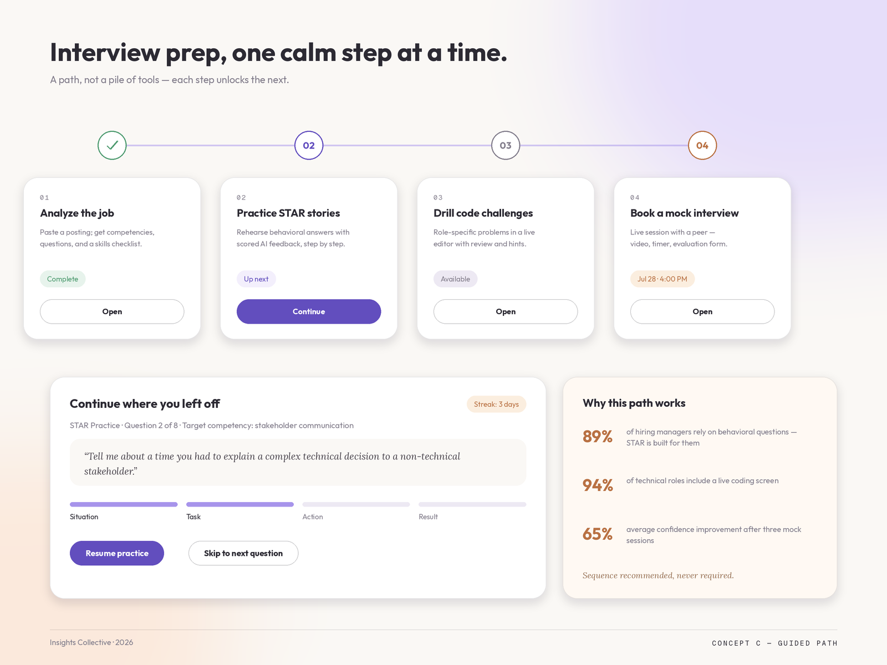

# Interview Prep — Soft Studio Concept Boards

Three layout alternatives for the `/interview-prep` hub, all in the established
Soft Studio system (plaster `#FAF8F5`, lavender `#A794EB`/`#624EBE`, peach
`#F0BE96`/`#B97143`, soft semantic good/warn/teal, Outfit + Lora Italic,
26px cards, pill controls) — the same tokens now live on `/resume`
(`.soft-studio` in `src/index.css`).

## Concept A — Studio Tabs

Consistency-first: mirrors the resume page exactly (pill tabs, feature card +
warm "why this matters" card, personal stat tiles). Cheapest to build — the
existing hub already uses this tab structure, so it's a restyle plus the new
personal strip (skills prepared, STAR streak, next session).

## Concept B — Practice Desk

No tabs — all four tools visible at once as bento tiles with per-tool accents,
plus a persistent "Your prep" rail: readiness ring, streak, skills checklist,
next session. Best glanceability; moderate build (new layout, same components).

## Concept C — Guided Path

Leans into the feature's real dependency (STAR needs a job analysis first):
a numbered journey with state chips (Complete / Up next / Available /
scheduled), a "continue where you left off" card with the actual STAR
question + S-T-A-R progress, and the evidence panel. Most opinionated;
turns the marketing page into a personal dashboard.

## Review findings to fix during implementation (any concept)

- `/interview-prep/mock-interview-room` route is registered without the
  `:sessionId` param that `MockInterviews` navigates with — Join Session lands
  on session-not-found.
- `/interview-prep/job-description` spins forever when logged out
  (`setIsLoading(false)` only runs for signed-in users).
- `src/components/interview-prep/flashcard.css` is dead (imported globally,
  classes unused) — delete.
- Palette is inconsistent per page (four pastel gradient families on the hub,
  slate on STAR, VS Code hexes on Code Practice, indigo/purple on the mock
  room) — all converge on Soft Studio tokens.
- Legacy near-duplicate routes `/mock-interviews` and `/code-practice` should
  redirect to the `/interview-prep/*` versions or be updated in tandem
  (`MonacoCard` is shared between both code pages).
