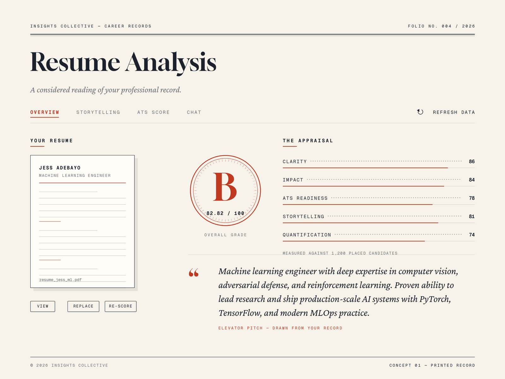
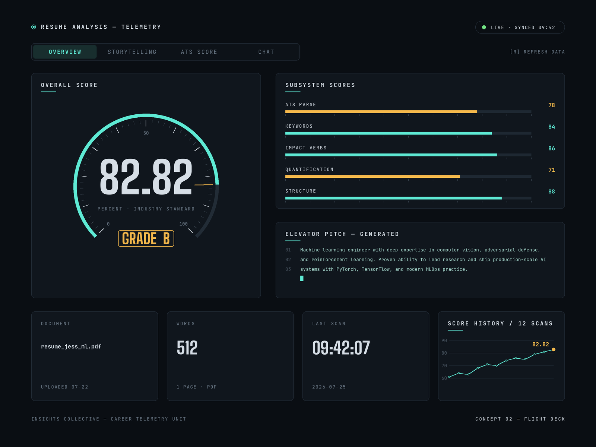
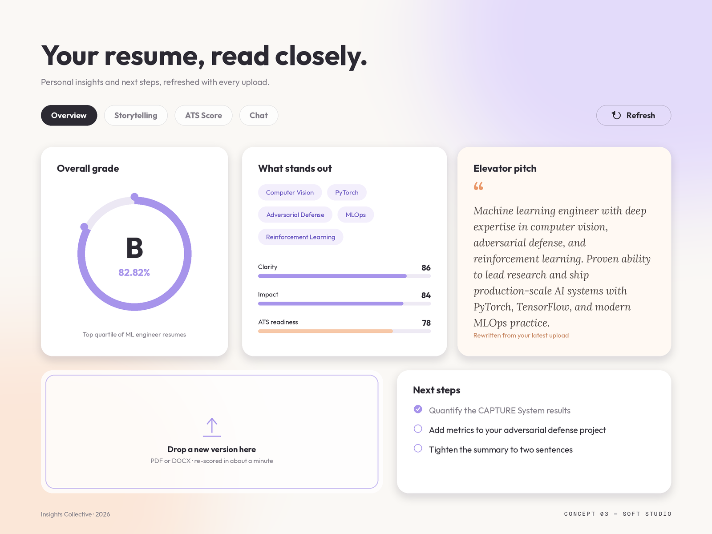

# Resume Analysis Page — Alternative Design Concepts

Three alternative visual directions for `/resume` (the Resume Analysis page), all preserving
the current information architecture: tabs (Overview / Storytelling / ATS Score / Chat),
overall grade (B · 82.82%), subscores, elevator pitch, resume document management, and
refresh action. The shared design philosophy behind all three is in
[`design-philosophy.md`](./design-philosophy.md).

## Concept 01 — Printed Record

An editorial, print-inspired register: warm ivory ground, iron-gall ink, a single vermillion
accent. The grade becomes a stamped seal; subscores read as a ledger with dotted leaders; the
elevator pitch is a pulled quote in an italic serif. Calm, credible, archival — positions the
analysis as a considered appraisal rather than a dashboard.

- Type: Gloock (display), Crimson Pro Italic (pitch), Geist Mono (labels/measurements)
- Palette: `#F7F3EB` ground · `#1C212B` ink · `#BF3A20` signal

## Concept 02 — Flight Deck

A dark instrument panel: the score is a radial gauge with a needle, subscores are calibrated
meters, the pitch renders as a terminal block with line numbers, and a sparkline tracks score
history across scans. High information density with a strict phosphor-cyan / caution-amber
signal system. Appeals to the technical audience (ML engineers) the product serves.

- Type: JetBrains Mono (labels/body), Big Shoulders (numerals)
- Palette: `#0A0E13` ground · `#5EEAD4` primary signal · `#F5B84B` caution signal

## Concept 03 — Soft Studio

The friendliest evolution of the current design: plaster-white ground with soft lavender and
peach gradient washes, large rounded cards, pill tabs, a thick progress ring around the grade,
skill chips, a drag-and-drop upload zone, and a "next steps" checklist. Closest to the existing
shadcn/Tailwind system, so it is the cheapest to implement incrementally.

- Type: Outfit (display/UI), Lora Italic (pitch)
- Palette: `#FAF8F5` ground · `#A794EB` lavender · `#F7C8A8` peach · `#2C2A33` ink

## Notes

Boards are 1600×1200 static concept renders (not code). Any of the three can be translated to
the existing Tailwind + shadcn/ui stack; Concept 03 maps most directly onto the current
component structure in `src/components/resume/`.
